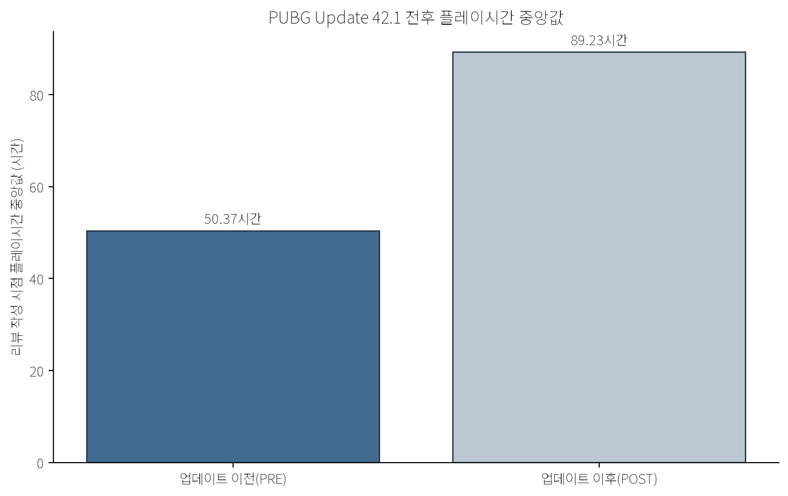

# PUBG Update 42.1 Steam 리뷰 분석

Python을 활용해 PUBG Update 42.1 전후 Steam 리뷰의 사용자 반응과 주요 VOC 이슈를 비교한 분석 프로젝트입니다.

## 1. 프로젝트 개요

**분석 질문:** PUBG Update 42.1 전후 Steam 리뷰에서 사용자 반응과 주요 불만 이슈는 어떻게 변화했는가?

UTC 기준 14일씩의 두 기간을 비교하고, 추천 비율·플레이시간·비추천 리뷰 이슈 비율을 확인했습니다. 이후 키워드 탐지 결과가 실제 리뷰 문맥에서도 타당한지 검증해, 단순 단어 빈도를 패치 효과로 과장하지 않도록 했습니다.

## 2. 분석 기간

모든 시간은 UTC입니다. 기준 시각은 확정된 배포 완료 시각이 아니라 `scheduled_maintenance_end_proxy`입니다.

| 구간 | 기간 |
|---|---|
| 업데이트 이전(PRE) | 2026-06-03 08:30 ~ 2026-06-17 08:30 |
| Update 42.1 기준 시각 | 2026-06-17 08:30 |
| 업데이트 이후(POST) | 2026-06-17 08:30 ~ 2026-07-01 08:30 |

## 3. 분석 흐름

```text
Steam 리뷰 데이터
        ↓
데이터 검증
        ↓
업데이트 이전(PRE) / 업데이트 이후(POST) 구분
        ↓
추천 비율 및 플레이시간 비교
        ↓
비추천 리뷰 이슈 키워드 태깅
        ↓
원문 문맥 검증
        ↓
해석
```

공개 저장소에는 집계표, 차트, 익명화된 짧은 발췌만 포함합니다. Steam 사용자 식별자, 원본 API 페이지, 원본 리뷰 전문, review-level CSV는 포함하지 않습니다.

## 4. 주요 결과

### 추천 비율

| 구간 | 리뷰 수 | 추천 리뷰 수 | 추천 비율 |
|---|---:|---:|---:|
| PRE | 667 | 524 | 78.56% |
| POST | 850 | 666 | 78.35% |

**변화: -0.21%p.** 전체 추천 비율에서 뚜렷한 변화는 관찰되지 않았습니다.

### 리뷰 작성 시점 플레이시간 중앙값

| 구간 | 플레이시간 중앙값 |
|---|---:|
| PRE | 50.37시간 |
| POST | 89.23시간 |

**변화: +38.86시간.** PRE와 POST는 동일 사용자를 추적한 cohort가 아니므로, 이 차이를 업데이트가 플레이시간을 증가시킨 결과로 해석하지 않습니다.

리뷰 길이 중앙값은 PRE **19자**, POST **15자**였습니다. 이는 기간별 리뷰 작성 방식의 차이를 보여주는 보조 지표이며, 감정 변화의 직접적인 측정값은 아닙니다.

### 비추천 리뷰 이슈 비교

이슈 비율의 분모는 각 기간 전체 비추천 리뷰입니다(PRE 143건, POST 184건). 하나의 리뷰에는 여러 태그가 붙을 수 있습니다.

| 이슈 | PRE | POST | 변화 |
|---|---:|---:|---:|
| Ranked / RP | 6.29% | 3.80% | -2.49%p |
| 매치메이킹 | 4.90% | 2.17% | -2.72%p |
| 치팅 / 공정성 | 20.98% | 17.93% | -3.04%p |
| 성능 / 기술 | 6.99% | 7.61% | +0.62%p |

일부 비추천 이슈 비율은 패치 이후 감소했고, 성능/기술 언급은 소폭 증가했습니다. 이는 Steam 리뷰 표본에서 관찰된 변화이지, 패치 영향의 추정치는 아닙니다.

## 5. 원문 문맥 검증

분석의 핵심 검증 흐름은 다음과 같습니다.

```text
키워드 탐지 → 정량 비교 → 원문 문맥 검증 → 해석
```

Ranked/RP 키워드 비율은 패치 이후 감소했지만, 공개 전 원문 검증에서 Update 42.1의 RP 계산 변경을 직접 언급한 리뷰는 PRE와 POST 모두 0건이었습니다. 따라서 이 프로젝트는 "RP 패치 때문에 Ranked 불만이 감소했다"고 결론내리지 않습니다.

상세 근거는 [분석 결과 문서](docs/findings.md), 공개용 문맥 표본은 [익명화된 발췌](outputs/representative_reviews_public.csv)에서 확인할 수 있습니다.

## 6. 시각화





## 7. 저장소 구조

```text
PUBG_Analysis/
├── README.md
├── requirements.txt
├── .gitignore
├── notebooks/
│   └── 01_pubg_update_analysis.ipynb
├── outputs/
│   ├── data_validation.csv
│   ├── negative_issue_comparison.csv
│   ├── representative_reviews_public.csv
│   └── summary_statistics.csv
├── figures/
│   ├── median_playtime.png
│   ├── negative_issue_change.png
│   ├── playtime_distribution.png
│   └── recommendation_rate.png
└── docs/
    └── findings.md
```

## 8. 실행 방법

```bash
python -m pip install -r requirements.txt
jupyter notebook notebooks/01_pubg_update_analysis.ipynb
```

노트북은 저장소 기준 상대경로를 사용합니다. 저장소 루트에서 실행하거나, 해당 위치를 기준으로 Jupyter를 실행하세요. API 호출이나 신규 데이터 수집은 수행하지 않습니다.

차트 한글 표시는 `Noto Sans KR`을 우선 사용하고, 없으면 `Malgun Gothic`을 사용합니다. 두 폰트가 모두 없어도 분석은 실행되지만 한글 글리프가 정상적으로 표시되지 않을 수 있습니다.

## 9. 사용 도구

- Python
- Pandas
- Matplotlib
- Jupyter Notebook
- Steam Review API (최초 로컬 수집에만 사용했으며, 이 저장소는 API를 호출하지 않음)

## 10. 한계

- Steam 리뷰는 전체 플레이어 모집단을 대표하지 않습니다.
- PRE와 POST는 동일 사용자 cohort가 아닙니다.
- 키워드 기반 태깅은 문맥을 완전히 이해하지 못해 false positive 또는 false negative가 생길 수 있습니다.
- 패치와 리뷰 변화의 인과관계를 직접 증명할 수 없습니다.
- 업데이트 기준 시각은 maintenance 종료 대리 시각입니다.

## 11. 학습 내용

이 Pilot의 핵심은 키워드 빈도를 곧바로 사용자 의견이나 패치 효과로 해석하지 않은 것입니다.

```text
키워드 탐지 → 정량 비교 → 원문 문맥 검증
```

이 마지막 문맥 검증이 관찰된 키워드 변화를 과도한 인과 해석으로 확장하지 않게 합니다.
