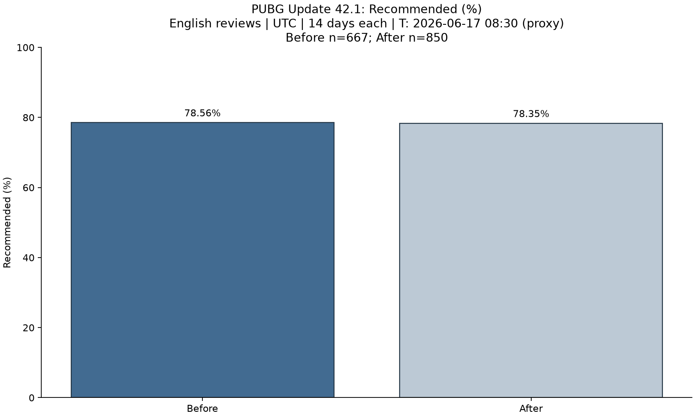
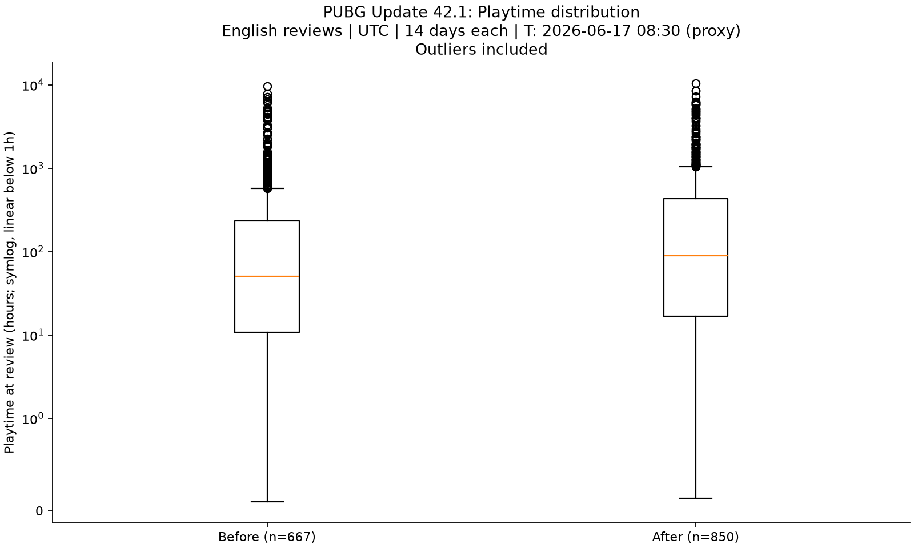
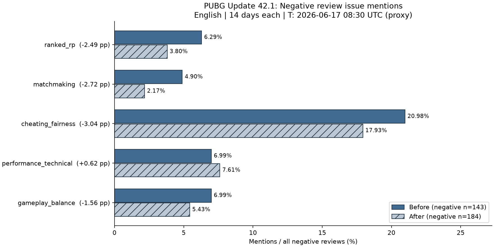

# PUBG Update Review Analysis

Steam review analysis of PUBG Update 42.1 using Python, issue tagging, and pre/post comparison.

## 1. Project overview

**Analysis question:** How did player reactions and major complaint topics change in Steam reviews before and after PUBG Update 42.1?

This project compares two 14-day Steam-review windows, then checks whether keyword-based changes hold up when the available review context is read. The objective is not to claim that a patch caused a change, but to show a reproducible workflow for validating user-feedback signals before interpreting them.

## 2. Analysis window

All timestamps are UTC. The update time is a `scheduled_maintenance_end_proxy`, not a confirmed deployment-completion time.

| Period | Window |
|---|---|
| PRE | 2026-06-03 08:30 to 2026-06-17 08:30 |
| Update 42.1 proxy | 2026-06-17 08:30 |
| POST | 2026-06-17 08:30 to 2026-07-01 08:30 |

## 3. Analysis pipeline

```text
Steam Review Data
        ↓
Data Validation
        ↓
PRE / POST Split
        ↓
Recommendation & Playtime Comparison
        ↓
Issue Keyword Tagging (negative reviews)
        ↓
Original Review Context Validation
        ↓
Interpretation
```

The repository intentionally publishes aggregate tables, figures, and short anonymized excerpts only. The private review-level source dataset, Steam identifiers, raw API pages, and full review texts are not included.

## 4. Key findings

### Recommendation rate

| Period | Reviews | Recommended | Recommendation rate |
|---|---:|---:|---:|
| PRE | 667 | 524 | 78.56% |
| POST | 850 | 666 | 78.35% |

**Change: -0.21pp.** Overall recommendation rate showed no material change across these windows.

### Median playtime at review

| Period | Median playtime |
|---|---:|
| PRE | 50.37h |
| POST | 89.23h |

**Change: +38.86h.** PRE and POST do not represent the same user cohort, so this must not be interpreted as the update increasing player playtime.

### Negative-review issue comparison

Issue percentages use all negative reviews in each period as their denominator (PRE n=143; POST n=184). A review can receive more than one tag.

| Issue | PRE | POST | Change |
|---|---:|---:|---:|
| Ranked / RP | 6.29% | 3.80% | -2.49pp |
| Matchmaking | 4.90% | 2.17% | -2.72pp |
| Cheating / fairness | 20.98% | 17.93% | -3.04pp |
| Performance / technical | 6.99% | 7.61% | +0.62pp |

Several negative-review issue shares declined in POST, while performance/technical mentions increased slightly. These are observed changes, not estimates of patch impact.

## 5. Context validation

The central safeguard in this analysis is:

```text
Keyword Detection → Quantitative Comparison → Original Review Validation → Interpretation
```

Ranked/RP keyword share declined after the update, but the available review context did not provide sufficient evidence connecting that change directly to Update 42.1's RP calculation modification. The semantic check found no validated direct RP-calculation feedback among the 16 keyword candidates. Therefore, this project does **not** conclude that the RP patch reduced Ranked complaints.

See [the detailed findings](docs/findings.md) and the privacy-safe [context excerpts](outputs/representative_reviews_public.csv).

## 6. Visualizations







## 7. Project structure

```text
PUBG_Analysis/
├── README.md
├── requirements.txt
├── .gitignore
├── notebooks/
│   └── 01_pubg_update_analysis.ipynb
├── outputs/
│   ├── data_validation.csv
│   ├── negative_issue_comparison.csv
│   ├── representative_reviews_public.csv
│   └── summary_statistics.csv
├── figures/
│   ├── negative_issue_change.png
│   ├── playtime_distribution.png
│   └── recommendation_rate.png
└── docs/
    └── findings.md
```

## 8. Run the notebook

```bash
python -m pip install -r requirements.txt
jupyter notebook notebooks/01_pubg_update_analysis.ipynb
```

The notebook uses repository-relative paths. Run it from the repository root or open it through Jupyter from that location.

## 9. Tools

- Python
- Pandas
- Matplotlib
- Jupyter Notebook
- Steam Review API (used for the original local collection; no API requests are made by this repository)

## 10. Limitations

- Steam reviews do not represent the full player population.
- PRE and POST are not the same-user cohort.
- Keyword-based tagging cannot fully understand context and can create false positives or false negatives.
- The analysis cannot directly prove a causal relationship between the patch and review changes.
- The update timestamp is a maintenance-end proxy.

## 11. What I learned

The key lesson from this pilot is that keyword frequency alone is not a player-opinion conclusion. A more defensible workflow is:

```text
Keyword Detection → Quantitative Comparison → Original Review Validation
```

That final context check is what prevents an observed keyword movement from being overstated as a patch effect.
